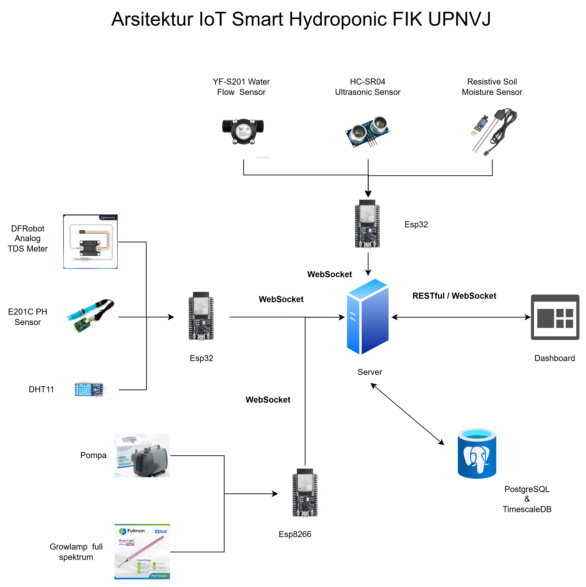

# Smart Hydroponic - IoT System

Sistem Otomasi Pengendalian dan Pemantauan Tanaman menggunakan teknologi IoT.

## Table of Contents

- [Introduction](#introduction)
- [System Overview](#system-overview)
- [Hardware Components](#hardware-components)
- [Software Components](#software-components)
- [Contributors](#contributors)

## Introduction

Saat ini kondisi global dihadapi dengan ketersediaan lahan dan air yang telah mencapai batasnya, hanya terdapat sedikit ruang untuk meningkatkan jumlah lahan yang subur sedangkan lebih dari 95% makanan berasal dari pertanian. Krisis global ini juga terjadi dalam skala lokal, contohnya di Kota Depok yang mengalami penurunan jumlah ketersediaan pertanian lahan kering sebesar 122.67 Ha dan sawah sebesar 31.89 Ha. Kondisi ini menuntut adanya solusi baru dalam sistem produksi pangan yang tidak lagi bergantung pada perluasan lahan, melainkan pada peningkatan efisiensi. Salah satu solusi yang semakin relevan adalah sistem pertanian yang tidak berbasis tanah seperti hidroponik yang mampu menghasilkan pangan dengan penggunaan air yang lebih hemat dan tidak memerlukan lahan subur dalam skala luas. Untuk memaksimalkan potensinya, penerapan sistem ini perlu diintegrasikan dengan teknologi Internet of Things (IoT) untuk menciptakan sistem smart hydroponic yang presisi dan otomatis.

## System Overview

Sistem IoT Smart Hydroponic dirancang untuk mengotomatisasi proses pengendalian dan pemantauan tanaman hidroponik. Sistem ini menggunakan berbagai sensor seperti moisture sensor, water flow, dan water level untuk mengumpulkan data tanaman, kemudian sensor untuk mengambil data linkungan seperti suhu, kelembaban, ph dan TDS. Data yang diterima akan dikirim ke server untuk diproses dan disimpan. Sistem ini juga dilengkapi dengan aktuator seperti pompa air dan lampu yang dapat dikendalikan secara automatis maupun manual melalui dashboard web.

## Hardware Components

1. ESP32
2. ESP8266
3. DHT11
4. Soil Moisture Sensor
5. Water Pump
6. Water Flow Sensor
7. Ultrasonic Sensor
8. pH Sensor
9. TDS Sensor
10. Motor DC
11. Grow Light LED
12. Relay Module
13. Breadboard
14. Jumper Wires

## Software Components

Software yang digunakan dalam proyek ini untuk mendukung pengembangan sistem IoT Smart Hydroponic meliputi:

1. **Arduino IDE**: Digunakan untuk pemrograman mikrokontroler ESP32 dan ESP8266.
2. **Visual Studio Code**: Digunakan sebagai lingkungan pengembangan utama untuk menulis kode dan mengelola proyek.
3. **Backend Framework**: Node.js dengan Express.js untuk mengembangkan API backend.
4. **Database**: Penyimpanan data menggunakan PostgreSQL dan ekstensi TimescaleDB untuk mengelola data time-series.
5. **Dashboard**: Dashboard dikembangkan menggunakan HTML, CSS, dan JavaScript. (Sedang pengembangan menggunakan React.js)
6. **Protokol Komunikasi**: Protokol komunikasi yang digunakan saat ini adalah WebSocket dan REST API untuk komunikasi antara perangkat IoT dan server.

## Architecture Diagram

## Contributors

| Name                                | Role/ID                      |
|-------------------------------------|------------------------------|
| Rido Zulfahmi, S.Kom., M.IT         | Ketua                        |
| Nurhuda Maulana, T.T., M.T.         | Anggota                      |
| 2210511044 - Rahman Ilyas Al-Kahfi  | Anggota                      |
| 2210511056 - Adinda Rizki Sya'bana Diva | Anggota                   |
| 2210511084 - Dzulfikri Adjmal       | Anggota                      |
| 2210511122 - Sudarma Yudho Prayitno | Anggota                      |
